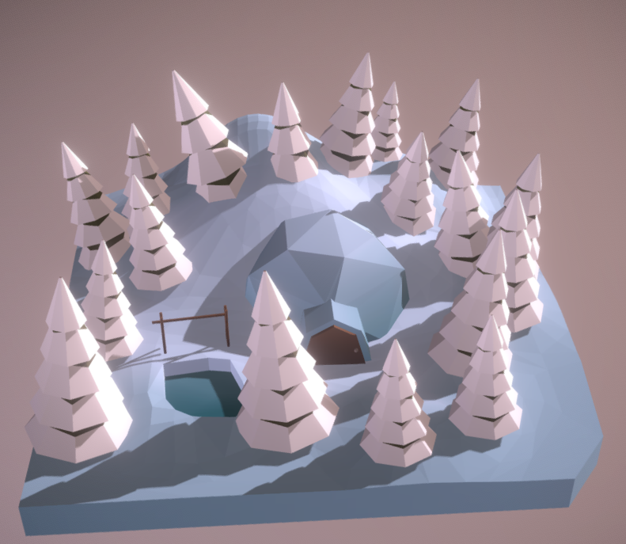
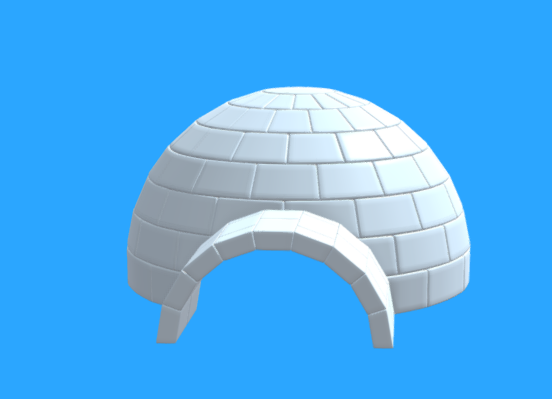

# 3D Modelling

## Ideas

First idea

The first idea I came up with was to create a scence which had an igloo and snow and a few extra items around and in the igloo. 
https://sketchfab.com/3d-models/winter-scene-d8ca573613704197b7ebe213ee13cb0b

https://sketchfab.com/3d-models/3december-day-7-igloo-41fd2befe0f84e8689933643dc394fe9

igloo
https://sketchfab.com/3d-models/3december-9-2018-igloo-fa5c2a7d45ae424dab171efec99388a7

igloo
https://sketchfab.com/3d-models/igloo-b066fb4f87be43cfa2774df9b7e454da

igloo
https://sketchfab.com/3d-models/igloo-07-3december-2018-ec69cab3becf469691262828e4a31561

Second idea

Browsing around on sketchfab, I came across this model.
This caused me to think 'It would look interesting having one half of the scene as snow and the other half with rocks and lava.'
https://sketchfab.com/3d-models/lava-golem-163e34affff64ebb85dd9619695ef480

https://i.pinimg.com/736x/1a/ce/7d/1ace7d6e3660e11d1e1847daf668d996.jpg

https://sketchfab.com/3d-models/fantasy-demon-caves-v2-2901d6e5292349fa9bad81fe15946b97

https://assets.st-note.com/production/uploads/images/9100195/picture_pc_73af74f3793f7088330941689a83dbd4.jpeg?width=800

https://sketchfab.com/3d-models/cave-entrance-b54d4854193945d9a1671482b0e6259f
